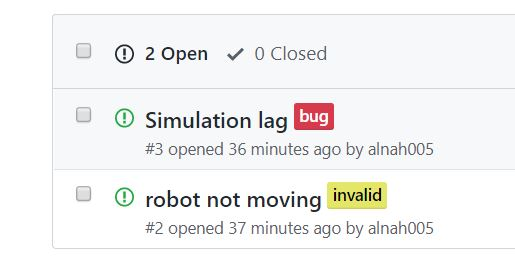

## Lab 10 : The Process of using Git for Developing the Project: Merging, Branching, and GitHub Issues

In this lab, you will prepare the iteration1 code (in the _project_ folder) and learn about how to develop code using best practices. The project base code will be added to your repo and you will establish a system for using Github _issues_ and creating branches to track and address those issues.

There is an informative guide on the use of git and branching that was developed by John Harwell, a former teaching assistant for this course. Please review this because, as part of project assessment, we will be looking at your use of _issues_, branching, and commit messages. This guide can be found in **_git-usage.pdf_** in the lab10_advanced_git folder.

### Git Branching and Merging (and other things!)

First, to give you good practice with the technical aspects of merging, branching, and other Git tasks, the website below is a nice, interactive practice application. It will walk you through a variety of tasks, giving you some experience with the actions you'll be required to make in the project work to come. Consider completing the Introduction Sequence.

https://learngitbranching.js.org/

### Branching Model

In a general git workflow, such as most you will encounter in industry, the `master` **branch is not the general purpose development branch**. Instead, a number of other branches are used to perform development, and only pristine (i.e. working/release/etc.) versions of the code are pushed to _master_.
For this class, we will be using a branching model in which we use the `devel` **branch as our primary iteration branch** -- one that can always compile -- and create other branches in which to develop the code. When we are ready "release" (i.e. submit for iteration1), then you will merge your _devel_ branch into _master_. This approach is inspired by http://nvie.com/posts/a-successful-git-branching-model.

#### Github Issues

As you develop your code, you will encounter a range of modifications that need to be made to the code, whether you are adding functionality, fixing it, or refactoring. More specifically, you might categorize the needed modifications as such:

| Category | Description |
|----------|-------------|
| Feature | An actual feature (i.e. adding new functionality to the code).
| Refactor | Refactoring existing code. Does not change behavior.
| Bug Fix | Fix a bug that was found in the code.
| Style | Updating/fixing code style (i.e. making it Google style compliant, for example).
| Doc | Adding/updating documentation for the code.
| Chore | Doing miscellaneous grunt work, such as file moving, renaming, etc.

Github provides a convenient and integrated method for keeping track of the needed modifications using **_Issues_**. As part of the development requirements of iteration1, we expect that you will be using these Github issues to track bugs, keep a list of feature enhancements, and needed refactorization.

Below is an example using issues to track bugs in a project:

<p align="center">  </p>

**The process of significant code modification should start with the creation of an issue that has an appropriate label attached to it** (in the example above, the label "bug" was used). The next step is to create a branch in which to address the issue.

#### Branch Titles and Types

- **Master**: Always contains 100% functional, working code. Push to this branch only for "releases," or in our case the submission of a complete iteration. Any time someone clones your repository and gets your master branch, they should *always* get a working version of code (even if it is not the most up-to-date, which could live on your _devel_ branch). For this class moving forward, the __master__ branch will be limited to the submission of project iteration items.

- **devel**: This is the main development branch, and also where all branches branch from or get merged into. You rarely make changes directly in _devel_, unless it is something trivial. Like the _master_ branch, anyone at any time should be able to pull from _devel_ to get code that compiles. For all consequential development work, a feature branch should be created off of _devel_ to contain the work.

- **Feature Branches**: These are the branches that should contain the actual development work. They should be named something specific (i.e. not just feature/phase2, but feature/phase2-widgetA-scaffolding). Keep your commits on these branches focused on the issue and make relatively few, unless the complexity of the feature warrants more. Resist the temptation to follow multiple paths and address multiple issues on a single feature branch. Instead, open an issue in github to track what you have found/want to do (See [Github Issues](https://guides.github.com/features/issues/)), and continue on with the work of the feature branch.

> A "Feature" branch is an umbrella term for many types of modifications to the code. Other common reasons for creating a branch include refactoring, bug fixes, formatting, documentation, and general clean-up.

#### Branch Names

When creating a new branch, you want the title to be easily associated with the issue it will address. It should contain the issue number, as well as a short description, possibly using the categories of modification listed above.

Notice in the image above that the "Simulation lag" bug is issue \#3. To address it, you would make a branch from _devel_ with an appropriate title, such as _fix/03-bus_simulation_lag_. You might prefer different wording, but **the important part is that it has the issue number in the title** and the name is meaningful.

> Note that you should probably only make one branch at a time so that you aren't trying to merge multiple branches into one. Create as many issues as is needed to track everything, but try to address only 1 at a time.

<hr>

### Steps before you start the lab

1. Finish lab09 and make sure your code compiles.
2. `git checkout master`  
3. `git pull`
4. Delete the `src` directory in `repo-x500/project/`
5. Stage (i.e. `git add`), commit (i.e. `git commit`) and push (i.e. `git push`) your changes into your remote repo.
6. Replace the `src` directory you just deleted with the `src` directory in the `lab10_advanced_git/` directory.  
7. Stage (i.e. `git add`), commit (i.e. `git commit`) and push (i.e. `git push`) your changes into your remote repo.  
8. Compile your project code and see if there are any changes.

<hr>

### Getting Started with devel

**Start preparing your repo.**  If your local repo differs from the server, you should commit and push before starting this process. In your `repo-<username>` repo:

```
git checkout master
git checkout -b devel
git push --set-upstream origin devel
```

`git checkout` is the command to change your local directory/repo to reflect the code in the branch you are checking out. By adding the flag `-b`, you are creating a new branch with the name that follows. This will be an exact copy of whatever is currently in your local repo. Now any modifications that you make in this new branch will stay in the branch until you merge it with another one.

Branches have to be pushed to the repo to be available to others (and to you on another machine). For the first push, you have to specify where the branch needs to go. (If you do `push` without the added flag "--set-upstream", git will tell you exactly what you need to type to push to the server.) Once you have done this initial command, only `git push` will be needed.

After you have pushed the branch, you can move between branches using checkout without the -b flag. You can seamlessly move between branches in your local repo.

To confirm which branch you are currently working on and to see a list of all branches use `git branch`.


<hr>

### Creating an Issue

Oops! Looks like the steps taken above injected a compilation error. After taking the steps, there should be 2 known issues in the project code that need fixing. The first is preventing compilation and the other not having any `cpplint` errors. Go to your repo on Github and create two issues, naming and labeling them appropriately. When you create an issue for the compilation error, label it with "bug" (from the pull down menu) and let's pretend that you added this issue when you first encountered it, therefore you provided additional information. Put the following into the comment of the issue related to compilation:

  "Simulator is not compiling. Compilation errors indicate the issue and where to locate the problem."

In general when you create an issue for a bug for this iteration, you need to provide this type of documentation in which you describe the bug, how to repeat it, what you think cause is, and where the likely cause is located. This is a somewhat unusual issue because we generally address simple compilation errors right away, but this is good practice for creating issues and branches.

Next, create an issue for Google style errors and label it with "enhancement". Put the following into the comment of the issue related to Google style:

  "The Project code is currently syntactically correct, however it seems some files do not follow Google style guide after running cpplint."

> To get the cpplint errors, from the src directory in your project directory (i.e. `repo-x500/project/src/`) run `../../cpplint/cpplint-cse.sh --root=. *.cc *.h`

<hr>

### Branch for Issues

**Confirm you are on the devel branch.**

Make a new branch with the name as specified below (if the bug issue is \#1, otherwise use its issue number). The entire string "fix/01-compilation-errors" is the name of the branch.

```
git checkout -b fix/01-compilation-errors
git push --set-upstream origin fix/01-compilation-errors
```

Go to github and click on the pulldown menu in the upper left to see your branch. If you select it, it will switch the visible content to the content of that branch.

### Fix the Bugs

Look at the error messages during compilation of the source code in the project directory and fix them.

Now compile! You don't want to merge your changes back into devel until it compiles.

After successful compilation, it's a good idea to run some tests to make sure your program is still behaving correctly. Refer to your _project_ directory and look for instructions on how to run tests on your project in the end of the `README.md` file.

If everything is working, **read the next section to learn how to format your commit messages BEFORE your commit anything**.

<hr>

### Commit Messages

As part of good documentation, it is important to record how the code was modified from the last commit. The git usage document outlines a template and offers a few examples. To make a more substantial commit, you need to **NOT** use the `-m` flag so that your configured editor opens for you to edit.

>The default editor is vim. If you want another editor, see the git usage document for how to change that.
>Also, previous labs are a good resource to remember git syntax and functionality.
>Make sure to let your TA know if you reach a dead end.

Start the commit process with

```
git add *
git commit
```

When you do this, you will notice a series of lines preceded by \# that include very useful information about the status of your repo. A little further down in the document there are directions on how to take the template in the git usage document and add that to the text that appears when your editor opens.

Now you want to add the short message at the top, as well as some more extensive comments underneath that.

```
fix(files): fix #1 <short description of commit>

- Multiple lines of description
- Lists all the important elements that have been changed
- etc.
```

The general style is to list the type of modification, in parentheses list the impacted files, then provide a short description of the change. The lines that follow provide specifics. Notice the \#1 in the message. When you use the issue number in the message, Github recognizes and adds the commit message as a comment to the issue creating a link between the issue and any related commits and branches. More on this [here](https://help.github.com/articles/closing-issues-using-keywords/).

Save and close your editor. Now push ...

```
git push --set-upstream origin fix/01-compilation-errors
```

> **Assessment/Feedback of the lab and of the project is conducted on the devel branch, so any feedback that you get is based on the code in devel. HOWEVER, the feedback files are posted to the master branch.**

The template provided in the git usage document can be added to git so that when the editor opens, you will see that content. To add the template, save the text preceded by '#' in the pdf as a file (_~/.gitmessage_ is the convention) and add to your git configuration:
```
git config --global commit.template ~/.gitmessage
```
<hr>

### Merge with devel

If you are satisfied with the results (for this lab, this means that the project builds successfully after the renaming is complete), you want to merge this branch with _devel_ (not with _master_). You can do this in 2 ways. If you want to take a trial run or if someone else is in control of merging branches, you can submit a _pull request_. This is a request to pull in your position branch into the devel branch. You can do this from the Github interface under Pull Requests. Then you can _accept_ the pull request to merge the branches. **Make sure your pull request is into the _devel_ branch - select from the pulldown menus.**

Command line is easier and faster, although the pull request will give you more information about the impact of the merge.

```
git checkout devel
git merge --no-ff fix/01-<short description of bug>
git push
```

The _--no-ff_ option tells git not to do a fast forward merge, and actually create a merge object, which is just a technical way of saying making it easier to roll back changes that break things.

> **Always** branch off of _devel_ and **always** merge back into it.

Go to Github and click on the issue. Notice that the commit has been added to it. Close this issue by clicking on the _Close issue_ button at the bottom.

We would normally suggest that you delete the branch, but then we won't be able to see your history of using branches. **DO NOT DELETE YOUR BRANCHES!!!**.

### Repeat

For the other issue related to the Google style, repeat the above process of creating a branch, working on the enhancment, merging the branch back into _devel_, and resolving the issue in Github. To finish the enhancment for this issue, fix the errors from the output of cpplint after running it from the src directory in your project directory (i.e. `repo-x500/project/src/`) run `../../cpplint/cpplint-cse.sh --root=.. *.cc *.h`.

<hr>

#### Parting Thoughts

Since we injected the bug directly into `master`, our `master` branch will not compile. So, **you need to merge your `devel` branch into `master` so that your `master` contains code that compiles.**  

Keep in mind that the issues are there to remind you what needs doing and fixing. This means that you use it like a todo list, writing things down as they occur to you.

It probably took you awhile in this lab to add the issue, make the branch, then merge it back into devel after the changes were made. This will go very quickly once you get in the habit, and we think you will eventually appreciate the documentation of the changes that have been made and the ones that still need to be made.

If you are addressing one of the priority points, follow this full process of issues and branching (and it might involve multiple issues and branches). But you don't have to do this _every_ time you make a change! If you have something minor -- skip making an issue, make the change in the devel branch, and use the command line for commit messages. The important part is to be consistent.


---

### Note on feedback regeneration

To trigger a feedback regeneration for this lab, you must modify a (any) file in `labs/lab10_advanced_git`.

The feedback server looks for changes in that folder and only regenerates if something within it has changed. Since the work for this lab will be done in `/project`, it will not regenerate automatically when you change files in that directory.

I would recommend that you just make a trivial change to the this file (e.g. add a word) to trigger the feedback regeneration!
